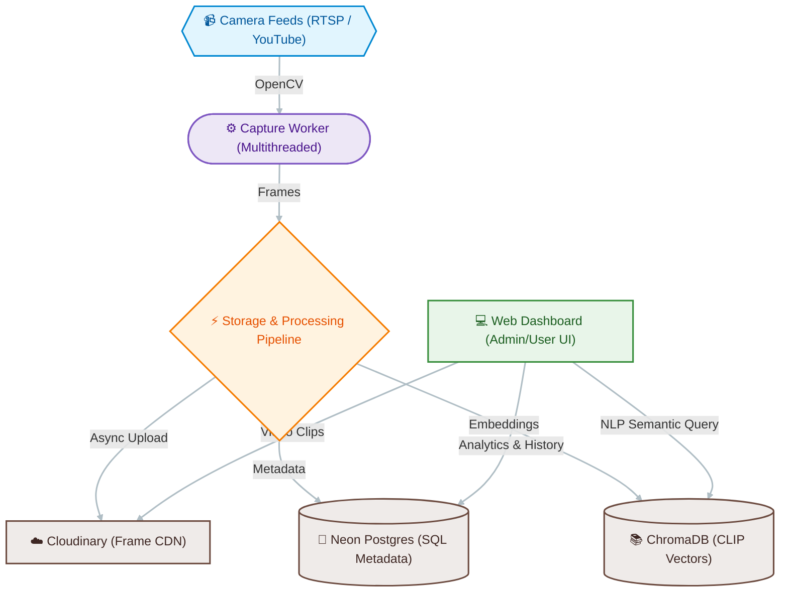

# 🛡️ SurveilX

[](https://www.python.org/)
[](https://fastapi.tiangolo.com/)
[](https://opencv.org/)
[](https://www.trychroma.com/)
[](https://cloudinary.com/)

**SurveilX** is a next-generation surveillance dashboard that combines real-time computer vision, NLP-based semantic search, and high-performance video processing. Designed for scalability and speed, it transforms raw video feeds into actionable intelligence.

> **Portfolio Note:** Developed collaboratively as part of university FYP.

---

## ✨ Key Features

- **🚀 High-Performance Capture**: Multithreaded 15 FPS frame capture from diverse sources (YouTube proxies, local cams, RTSP).
- **🧠 Semantic NLP Search**: Search through historical footage using natural language (e.g., *"A person in a red shirt"*), powered by **OpenAI CLIP**.
- **🚨 Real-Time Violence Detection**: Built-in CNN-LSTM Fusion model for instant alerting on critical events like fighting or burglary.
- **📈 Live Analytics**: Role-based dashboards featuring dynamic charts for alert frequency, system health, and camera throughput.
- **☁️ Cloud-Native Persistence**:
  - **Neon Postgres**: Relational metadata storage.
  - **Railway ChromaDB**: High-speed vector search engine.
  - **Cloudinary**: Global CDN for instant frame and clip retrieval.
- **🎬 Adaptive Clip Generation**: Instantly generate and upsample video clips from any time period with 1:1 real-time playback accuracy.

---

## 🏗️ Architecture



---

## 🛠️ Tech Stack

- **Backend**: FastAPI (Python)
- **Frontend**: Vanilla HTML5/CSS3/JS (Modular Dashboard)
- **Computer Vision**: OpenCV, OpenAI CLIP
- **Deep Learning**: PyTorch (Violence Detection)
- **Database**: PostgreSQL (SQLAlchemy) + ChromaDB (Vector)
- **Infrastructure**: Cloudinary (CDN), yt-dlp (Stream Resolution)

---

## 🚀 Quick Start

### 1. Prerequisites
- Python 3.11+
- Virtual Environment (recommended)

### 2. Installation
```bash
# Clone the repository
git clone https://github.com/abdulah-naeem/SurveilX.git
cd SurveilX

# Create and activate virtual environment
python -m venv venv
source venv/bin/activate  # On Windows: .\venv\Scripts\activate

# Install dependencies
pip install -r requirements.txt
```
### 3. Model Weights
The deep learning model weights for real-time violence detection are excluded from Git. 
- Place your trained `cnn_lstm_fusion.pth` file inside the `models/` directory.
- If the model weights are missing, the system will automatically run in **Demo / Simulation Mode** (described below).

### 4. Configuration
Copy `.env.example` to `.env` and fill in your credentials:
```bash
cp .env.example .env
```
*Required: `SURVEILX_DB_URL`, `CLOUDINARY_*`, `CHROMA_HOST`.*

### 5. Running the Application
```bash
# Start the web server
uvicorn app:app --host 0.0.0.0 --port 8000
```
Visit `http://localhost:8000` to access the dashboard.

### 🎬 Demo & Simulation Mode
If the main deep learning model weights (`models/`) are not found, SurveilX automatically falls back to **Demo / Simulation Mode**:
- In this mode, the system simulates real-time violence detection alerts using pre-defined event intervals specified in `config/demo/script.json`.
- You can customize the simulated alert timelines (labels, start, and end times in seconds) for YouTube camera streams by editing the JSON configurations in `config/demo/script.json`.

---

## 📂 Directory Structure

- `app.py`: Main FastAPI entry point and async workers.
- `src/`: Core logic modules (capture, processing, metadata).
- `web/`: Modern dashboard frontend (static assets).
- `config/`: System settings, database connections, and simulated event timelines (`config/demo/`).
- `models/`: Placeholder for AI model weights (excluded from git).
- `data/`: Temporary storage for processed frames/clips (excluded from git).

---

## 🛡️ Security & Privacy
- **Role-Based Access**: Separate Admin and Operator dashboards.
- **Environment Isolation**: No hardcoded secrets; all credentials managed via `.env`.
- **Auto-Retention**: Configurable background cleanup worker to manage data lifecycle.

---

## 📜 License
Academic/Educational Use Only. 

---
Developed with ❤️ by **Abdullah**
